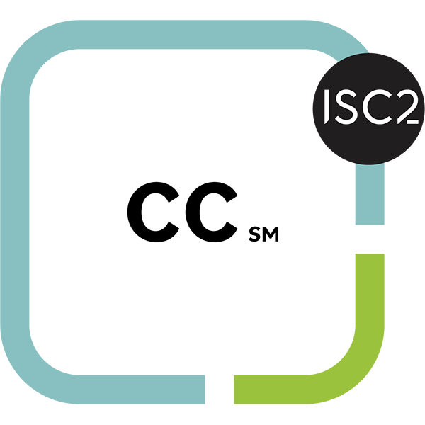

# Welcome to My GitHub Profile

👋 Hello! I'm MOHAMMED ABDUL RAQEEB (@Raqeeb27), a passionate cybersecurity enthusiast and software engineer with hands-on experience in security, development, and problem-solving across multiple tech domains.   

 

### **🛡️ Cybersecurity Enthusiast | Offensive & Defensive Security Engineer | 💻 Aspiring Software Engineer**  

 

  

 

## ‍💻 My Tech Skills

 

## 🏆 My Certifications

    &nbsp;&nbsp;&nbsp;&nbsp;
    

 

## My TryHackMe Stats

 

## My Github Stats

 

## 🌱 My Interests

🛡️ Offensive & Defensive Security | 🔍 CTF Solver  
🧩 Problem Solving | 🎮 Game Development with Unity  

 

## 🔗 Connect with Me

&nbsp;&nbsp;
&nbsp;&nbsp;
&nbsp;&nbsp;
&nbsp;&nbsp;
&nbsp;&nbsp;
  

 

  🤝 *I'm always open to exciting collaborations and security-focused projects. Let's build something impactful together!*
  

<!-- **Raqeeb27/Raqeeb27** is a ✨ _special_ ✨ repository because its `README.md` (this file) appears on your GitHub profile.

Here are some ideas to get you started:

- 🔭 I’m currently working on ...
- 🌱 I’m currently learning ...
- 👯 I’m looking to collaborate on ...
- 🤔 I’m looking for help with ...
- 💬 Ask me about ...
- 📫 How to reach me: ...
- 😄 Pronouns: ...
- ⚡ Fun fact: ...
-->
